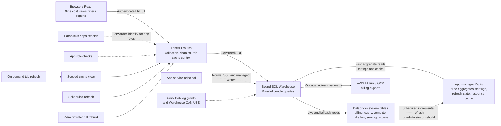

<div align="center">
  <picture>
    <source media="(prefers-color-scheme: dark)" srcset="client/public/brand/costobs-lockup-white.svg">
    
  </picture>
</div>

[](#release-v12)
[](https://accounts.cloud.databricks.com/select-workspace?destination_url=/apps/install?repo_url=https://github.com/smathews13/cost-obs-databricks-v1.0)

> **⚠️ Not Official Databricks Software**
> This application is built and maintained by the Databricks field engineering team and is **not an official Databricks product**. It is not covered by Databricks Support SLAs. Your Databricks account team can help you deploy, configure, and troubleshoot this app as part of your engagement.

> **🔧 Customization Notice**
> You are welcome to modify and customize this application's source code to fit your organization's requirements. However, be aware that local customizations may conflict with future upstream updates. We recommend tracking your changes in a fork and reviewing diffs carefully before pulling upstream updates.

> **📌 v1 series (currently `v1.2`)**
> Visual refresh and ongoing v1 features ship here. This repository includes a
> backup Declarative Automation Bundle, while Deploy from Git remains the primary
> path. A separate Lakebase-first v2 line is under development. Existing v1
> customers can stay on this app and coordinate any future migration with their
> Databricks account team.

---

A full-stack Databricks App for account-level compute cost visibility, chargeback, and anomaly detection across your entire Databricks platform.

Built on FastAPI + React, deployed as a [Databricks App](https://docs.databricks.com/en/dev-tools/databricks-apps/index.html) with service principal authentication and serverless compute built in. Supports **multi-cloud deployment** across AWS, Azure, and GCP with automatic cloud detection.

---

<a id="readme-map"></a>
## README map

- [Deploy in six steps](#deploy)
- [Release highlights](#release-highlights)
- [Feature guide](#features)
- [Architecture and data lineage](#architecture)
- [Detailed deployment guide](#detailed-deployment)
- [Backup DAB deployment](#backup-dab-deployment)
- [Cloud cost integration](#cloud-cost-integration)
- [Cross-workspace aggregate sharing](#cross-workspace-sharing)
- [Security](#security)
- [Project structure](#project-structure)
- [API overview](#api-overview)
- [Tech stack](#tech-stack)
- [Customer-facing changelog](CHANGELOG.md)

---

<a id="deploy"></a>
## Deploy in six steps

### Requirements

- A Databricks workspace with **Apps** and **Unity Catalog** enabled
- Workspace administrator access to create and configure the app
- A metastore administrator, or someone who can grant the required system-table access
- Read access to `system.billing.usage` and `system.billing.list_prices`
- A bound SQL warehouse; **Serverless Medium** is a practical starting point

Optional grants enable richer SQL, compute, Lakeflow, model-serving, and workspace-name views. The app reports these features as unavailable when their source tables are not granted.

### Process

1. Create a Databricks App from this Git repository and the `main` branch.
2. Bind a SQL warehouse resource with **Can use** permission and resource key `sql-warehouse`.
3. Deploy the app and wait for **Running**; the committed `static/` artifact is served directly, so deployment does not build the frontend.
4. Open the app and use the setup wizard to choose and validate a dedicated catalog/schema.
5. Apply the service-principal grants and build the managed aggregate tables from the wizard.
6. Confirm the DBU Overview loads; then enable optional source grants or cloud billing exports as needed.

Deploy from Git is the primary and recommended path. A [backup DAB path](#backup-dab-deployment) is included for workspaces where Git deployment is unavailable.

---

<a id="cross-workspace-sharing"></a>
## Cross-workspace aggregate sharing

Admins can open **Export → MV Share Runbook**
and download a standalone Databricks notebook. Import it into the workspace
that owns the source system tables, review the catalog/schema/share widgets,
and use **Run All**. The notebook:

1. Preflights the four required system tables and prints exact grant SQL.
2. Builds each compatible aggregate and marks permission-dependent tables as skipped.
3. Verifies successful tables and reports their row counts.
4. Creates or reuses a Delta Share in upgrade-safe table mode by default. Schema mode
   is available for new shares, but replacing an existing table-level share requires
   explicit confirmation after recipient app access is verified.
5. Optionally grants an existing Delta Sharing recipient access.
6. Prints the receiving-workspace schema grants required by the app service principal
   to discover current and future shared aggregates.

The notebook is generated from the same SQL constants used by the app. The
release gate fails if the checked-in runbook drifts from the runtime table
contract.

When local and shared sources cover the same workspace and date, the default
all-source view keeps one row per aggregate business key instead of double
counting it. Explicit source filters still expose each source independently.

---

<a id="release-highlights"></a>
## Release highlights

<a id="release-v12"></a>
### v1.2 · refreshed 2026-09-08

[](#release-v12)

- Refreshed the complete cost-obs visual system across navigation, charts, filters, settings, and PDF exports.
- Standardized semantic chart colors and improved text contrast for faster, more accessible interpretation.
- Linked date, workspace, and data-source scopes across dashboard tabs, with
  consistent loading feedback and one-step reset behavior.
- Improved cross-workspace aggregate sharing, source mapping, and duplicate
  protection for account-wide deployments.
- Clarified serverless SQL warehouse metrics and regional SQL billing coverage
  instead of presenting unsupported idle-time or query-attribution values.
- Hardened first-run setup recovery, managed-table validation, scoped cache
  clearing, and unavailable-feature handling.
- Added a customer-facing architecture report with explicit tab-to-source lineage and refresh behavior.

<a id="release-v11"></a>
### v1.1 · 2026-07-03

[](#release-v11)

- Accelerated Apps and Tagging views with managed Delta aggregates and live fallbacks.
- Improved recovery after cold-warehouse timeouts so temporary empty results do not remain cached.
- Strengthened refresh coordination, workspace filtering, chart stability, and initial-page performance.

Upgrades from v1.0 or v1.1 require no new environment variables or manual backfill. Redeploy the app; setup detects and builds missing managed tables while supported live fallbacks keep views available. See [CHANGELOG.md](CHANGELOG.md) for concise release notes.

---

## What's changed in the new deployment model

- **Setup is simpler.** The SQL warehouse is bound as an Apps resource and
  injected as `DATABRICKS_WAREHOUSE_ID`. The setup wizard chooses the managed
  catalog/schema and the initial workspace pool. Dashboard workspace and data
  source filters can then narrow that configured scope without a redeploy.

- **`app.yaml` is canonical for warehouse binding.** Its `valueFrom: sql-warehouse` entry supplies `DATABRICKS_WAREHOUSE_ID`; `app_config.json` intentionally contains no warehouse ID or pseudo-ID field.

- **Fake zeros are gone.** If a required grant is missing, the app shows that the affected metric is unavailable and points to the fix — instead of rendering a misleading $0.00 value.

- **Setup experience is consistent across tabs.** Access, data-table configuration, and readiness share the same underlying state so customers do not see one section report healthy while another shows stale errors after a grant or rebuild.

- **Diagnostics surface actionable next steps.** Instead of raw error details, the app maps failures to specific actions — **Grant SQL**, **Rebuild**, or **Configure** — so customers can move directly to the fix.

**Deploy from Git remains the primary deployment path.** The backup DAB packages the same committed runtime artifact and is intentionally separate; it does not replace or modify the Git setup flow.

---

<a id="detailed-deployment"></a>
## Detailed deployment guide

### Setup Requirements

#### Required

| Requirement | Notes |
|---|---|
| **Databricks workspace with Apps enabled** | Deploy from Git is available in supported workspaces with Databricks Apps enabled |
| **Unity Catalog enabled** | Required — the app reads from UC system tables and stores app-managed tables in UC |
| **Access to core system tables** | At minimum: `system.billing.usage` and `system.billing.list_prices` |
| **SQL warehouse** | A warehouse must be bound to the app. The recommended path is a SQL warehouse resource bound as `sql-warehouse` so the app receives `DATABRICKS_WAREHOUSE_ID` automatically |
| **Workspace Admin role** | Needed to create the app and, if required, remediate warehouse access |
| **Metastore Admin role, or access to one** | Needed to run the required Unity Catalog system table grants during setup |

#### Recommended warehouse

Use a **Serverless SQL warehouse**. The app is designed to read through a bound warehouse resource — add a `sql-warehouse` resource in app configuration rather than relying on manual runtime switching.

A **Medium** warehouse is a sensible starting point for initial table creation and normal dashboard usage. If you use Pro or Classic instead, expect slower startup and rebuild times.

#### Optional system tables

These are not required for the initial deployment, but they unlock additional parts of the app:

| Optional access | What it enables |
|---|---|
| `system.query.history` | SQL Warehousing views, query attribution, and warehouse rightsizing |
| `system.compute.clusters` | Cluster metadata and compute-oriented breakdowns |
| `system.lakeflow.*` | Job and pipeline name resolution and workflow KPIs |
| `system.serving.served_entities` | Model serving and AI/ML enrichment |
| `system.access.workspaces_latest` | Human-readable workspace names |

---

### Step 1 — Create the app from Git

> **Workspace preview required:** If you do not see a **Git repository** option when creating an app, enable it first: go to **Settings → Workspace Previews**, find **"Deploy Databricks apps from Git repositories (Beta)"**, and toggle it **ON**. This is a per-workspace setting and requires workspace admin access.

1. In your Databricks workspace, open **Apps**
2. Click **Create app**
3. Select **Git repository** as the source
4. Enter the repository URL: `https://github.com/smathews13/cost-obs-databricks-v1.0`
5. Use the `main` branch
6. Give the app a name such as `cost-observability`
7. Click **Create**

---

### Step 2 — Bind the SQL warehouse resource

Bind a SQL warehouse resource in the Apps UI so the warehouse ID is injected automatically. This is the recommended pattern for Databricks Apps and avoids manual warehouse wiring.

1. Open the app's **Settings** page (three-dot menu on the app card)
2. In **Resources**, click **Add resource**
3. Choose **SQL warehouse**
4. Select the warehouse you want the app to use
5. Set the permission to **Can use**
6. Leave the resource key as `sql-warehouse`
7. Save the configuration

Do not add a SQL user-authorization scope. Dashboard queries, setup operations, and managed-table maintenance all execute as the app service principal; forwarded user identity is used only for app-role checks.

---

### Step 3 — Review environment variables

The app keeps the initial deployment as simple as possible. The SQL warehouse
is an Apps resource. The setup wizard can choose the managed catalog/schema and
workspace pool after the app starts; the variables below are optional
deployment-time overrides.

> Environment-variable overrides require a redeploy to change. In-app date,
> workspace, and data-source filters remain adjustable within the configured
> scope.

| Variable | Default | Change if… |
|---|---|---|
| `COST_OBS_CATALOG` | Set by setup wizard | You want to pre-configure the managed catalog |
| `COST_OBS_SCHEMA` | Set by setup wizard | You want to pre-configure the managed schema |
| `COST_OBS_WORKSPACES` | Chosen in setup, or all workspaces | You want to pre-configure the allowed workspace pool |

Keep the first deployment minimal. Add optional cloud-cost or advanced integrations only after the base app is healthy.

<details>
<summary>All environment variable overrides</summary>

| Variable | Default | Description |
|---|---|---|
| `DATABRICKS_HOST` | Auto-detected | Override the workspace URL if not picked up automatically |
| `DATABRICKS_HTTP_PATH` | Auto-detected from resource binding | Point to an existing warehouse, or omit to use the bound resource |
| `COST_OBS_CATALOG` | Set by setup wizard | Unity Catalog catalog for app-managed tables. When set, takes precedence over the wizard value |
| `COST_OBS_SCHEMA` | Set by setup wizard | Schema name for app-managed tables. When set, takes precedence over the wizard value |
| `COST_OBS_WORKSPACES` | All workspaces | Comma-separated workspace IDs to scope the dashboard |
| `AZURE_SUBSCRIPTION_ID` | — | Azure subscription ID (shown in account banner on Azure) |
| `SMTP_HOST` / `SMTP_*` | — | Email alert configuration |
| `AWS_COST_CATALOG` / `AWS_COST_SCHEMA` | `billing` / `aws` | AWS CUR actual cost tables |
| `AZURE_COST_CATALOG` / `AZURE_COST_SCHEMA` | `billing` / `azure` | Azure cost export tables |
| `GCP_COST_CATALOG` / `GCP_COST_SCHEMA` / `GCP_COST_TABLE` | `billing` / `gcp` / auto-discovered | Raw Google Cloud Billing standard export in a Unity Catalog BigQuery foreign catalog. Set the exact suffixed table when more than one export exists |
| `DATABRICKS_TOKEN` | — | Service principal token override; not needed when deployed as a Databricks App |
| `COST_OBS_FEEDBACK_GITHUB_URL` | Public issue form | Optional HTTPS `github.com` issue-form override |
| `COST_OBS_FEEDBACK_EMAIL` / `COST_OBS_FEEDBACK_SLACK_URL` | — | Optional public feedback routes. Slack accepts a `slack://user?...` deep link or an HTTPS workspace member profile; unsafe or incomplete values are omitted |
| `COST_OBS_FEEDBACK_SLACK_TEAM_ID` / `COST_OBS_FEEDBACK_SLACK_MEMBER_ID` / `COST_OBS_FEEDBACK_SLACK_WEB_URL` | — | Legacy split Slack target; configure only at runtime and never commit real team/member IDs |
| `COST_OBS_DEPLOYED_AT` / `COST_OBS_DEPLOYER` / `COST_OBS_COMMIT_SHA` | — | Optional release provenance used only when the active Databricks Apps deployment API cannot supply a field |

</details>

---

### Step 4 — Deploy

1. Click **Deploy**
2. Wait for the app status to show **Running**
3. Open the app URL

The deployment installs Python dependencies, starts the backend, and serves the committed `static/` frontend artifact. It does not run a frontend package install or build. Once the app is running, the first-run setup flow begins.

---

### Step 5 — Complete first-run setup

On first open, the app checks the environment, validates permissions, and creates the app-managed tables.

#### 5a — Confirm readiness

The app shows whether the warehouse, core system tables, and optional feature dependencies are ready. If the app reports a missing dependency, remediate it before proceeding.

#### 5b — Complete the Setup Wizard

The built-in Setup Wizard handles grants and table creation on first run. You do not need to navigate into Settings manually for initial setup.

- **Grants:** The wizard verifies and applies grants for the app service principal. If the service principal cannot grant itself the required privileges, the wizard displays SQL for the appropriate metastore or workspace administrator to run, then **Re-check** confirms the result.

- **Table build:** Once grants pass, the wizard prompts you to build the pre-aggregated tables used by the dashboard. Click **Build**. This runs in the background on your warehouse and typically takes 3–8 minutes.

- **Workspace filter:** If `COST_OBS_WORKSPACES` was not set at deploy time, the wizard prompts you to choose workspace scope before completion. If workspace IDs were set as an environment variable, this step is skipped.

If you need to repair grants or rebuild tables later, use **Settings → Identity
& Permissions** and **Settings → Data & tables**. These are the ongoing
management surfaces after initial setup.

---

### Step 6 — Verify the deployment

After setup completes, confirm:

- The main billing views load
- Readiness is green for core dependencies
- Optional areas only show as unavailable if their supporting system tables were not granted
- No dashboard tile is blocked by a missing warehouse or system table grant

If anything is degraded, go to **Settings → Identity & Permissions** or
**Settings → Data & tables** to identify whether the issue is warehouse access,
missing system table grants, missing app-managed tables, or a schema mismatch.

---

### Minimum access for end users

This deployment path uses the **app service principal** for SQL execution. End users do not need any additional authentication for normal app usage.

Use **Settings → Identity & Permissions** to manage who can administer or view
the app.

---

### Troubleshooting

| Symptom | Likely cause | Recommended action |
|---|---|---|
| Warehouse access failure after deploy | Warehouse resource missing, wrong warehouse selected, or access drift | Verify the bound SQL warehouse resource; rerun the warehouse-related remediation SQL if prompted |
| Billing tabs show no data | Core system table grants not applied | Run the required runtime grants from **Settings → Identity & Permissions**, then click **Re-check** |
| Optional tabs are unavailable | Optional system tables (`system.query.history`, `system.compute.clusters`, etc.) were not granted | Grant the optional dependencies you want to enable, then re-check readiness |
| Rebuild required or schema mismatch | App-managed tables are missing or out of sync | Rebuild from **Settings → Data & tables** |
| Deploy from Git option not visible | Workspace preview not enabled | Enable the Git deployment preview in **Settings → Workspace Previews** |
| Data looks stale | App-managed tables have not been refreshed recently | Rebuild from **Settings → Data & tables** |

---

<a id="backup-dab-deployment"></a>
## Backup DAB deployment

Use this only when the primary **Deploy from Git** flow is unavailable. The
`backup` target deploys the same committed `static/` and FastAPI runtime. Its
bundle resource supplies the equivalent startup command, SQL warehouse binding,
and catalog/schema overrides from the required `--var` values. Its default app name,
`cost-observability-backup`, is deliberately separate from the Git-managed app.

From a clean checkout of the commit you want to deploy:

```bash
databricks bundle validate --strict -t backup --profile <profile> \
  --var "warehouse_id=<warehouse-id>,catalog=<catalog>,schema=<schema>"

databricks bundle deploy -t backup --profile <profile> \
  --var "warehouse_id=<warehouse-id>,catalog=<catalog>,schema=<schema>"

databricks bundle run cost_obs_backup -t backup --profile <profile> \
  --var "warehouse_id=<warehouse-id>,catalog=<catalog>,schema=<schema>"
```

Use the same dedicated catalog/schema as the primary app if the backup should
reuse its managed tables. A new backup app receives a new service principal, so
apply the catalog/schema and system-table grants shown by its setup wizard.
Override `app_name` only when you intentionally want another name; do not point
the backup target at the primary app during normal operation.

---

<a id="features"></a>
## Feature guide

### DBU Overview
| Feature | Description |
|---|---|
| **Spend Over Time** | Daily spend timeseries by product category |
| **Spend by Product** | Horizontal bar chart with workspace filter — SQL, ETL, Interactive, Model Serving, AI Search, Fine-Tuning, AI Functions, Serverless |
| **Spend by SKU** | Top 10 SKUs with workspace filter |
| **Spend by User** | Top spenders by DBU cost |
| **Workspace Table** | Per-workspace cost breakdown with top products/users |
| **Interactive Compute** | All-purpose cluster usage by user, cluster, or notebook with historical toggle |
| **ETL Breakdown** | Jobs and SDP pipeline spend with type filters, pagination, and historical toggle |
| **Account Prices Toggle** | Switch between list prices and negotiated account prices (from `system.billing.account_prices`, private preview) |

### SQL
| Feature | Description |
|---|---|
| **Query Spend by Source** | Daily cost timeseries by query source type (DBSQL, Genie, Dashboard, etc.) |
| **Warehouse Spend by Type** | Daily spend area chart segmented by Serverless/Pro/Classic |
| **Warehouses by Size** | Distribution of warehouses by size with workspace filter |
| **Top Users** | Highest-cost SQL users |
| **Query Source Breakdown** | Drill-down table by source type |
| **Most Expensive Queries** | Top queries with historical toggle, pagination, and query profile links |
| **Warehouse Rightsizing** | Automated recommendations to right-size overprovisioned warehouses based on `system.query.history` utilization heuristics |

### AI/ML
| Feature | Description |
|---|---|
| **AI/ML Spend Over Time** | Stacked area chart by AI/ML category |
| **Cost by Category** | Donut chart of spend distribution |
| **Top Serverless Endpoints** | Highest-cost inference endpoints |
| **ML Runtime Clusters** | Clusters running ML/GPU runtimes with hyperlinks, pagination, and historical toggle |
| **Agent Bricks** | Knowledge Assistants and other agent types with type filters, pagination, and historical toggle |

### Apps
| Feature | Description |
|---|---|
| **App Cost Dashboard** | Per-app spend with SKU breakdown drill-down |
| **Connected Artifacts** | Serving endpoints, SQL warehouses, and other resources used by apps |

### Tagging Hub
| Feature | Description |
|---|---|
| **Tag Coverage** | Tagged vs untagged spend ratio |
| **Spend by Tag** | Cost attribution by tag key/value pairs |
| **Spend by Key** | Horizontal bar chart of top tag keys |
| **Untagged Resources** | Clusters, jobs, pipelines, warehouses, and endpoints missing tags — with dynamic suggested tags per resource type, historical toggle, and pagination |

### Users
| Feature | Description |
|---|---|
| **Users by Spend** | Ranked list of users by total DBU cost across all products |
| **Spend Over Time per User** | Daily timeseries for any selected user |
| **Product Breakdown** | Cost split by product category per user |
| **User Growth Trend** | Active user count over time |

### KPIs & Trends
| Feature | Description |
|---|---|
| **Platform KPIs** | Total spend, DBUs, successful runs, active clusters, workspaces, models served |
| **KPI Drill-Downs** | Click any KPI to see daily/monthly trend lines in a modal |
| **Spend Anomalies** | Largest day-over-day spend changes with date search and AI analysis |

### Cloud Costs
| Feature | Description |
|---|---|
| **Multi-Cloud Support** | Auto-detects AWS, Azure, or GCP from workspace URL; displays cloud-specific logos, instance types, pricing links, and setup guides |
| **Infrastructure KPIs** | Databricks compute spend, DBUs, and average active clusters/day |
| **Usage Over Time** | Daily classic-cluster DBUs |
| **Instance Family Usage** | DBUs by EC2 (AWS), VM series (Azure), or machine type (GCP) instance family |
| **Cluster Table** | Per-cluster cost attribution with instance types, pricing links, pagination, and historical toggle |
| **Actual Costs Integration** | Currency costs from AWS CUR 2.0, Azure Cost Management Export, or GCP Billing Export |
| **Cloud Integration Wizard** | In-app 5-step setup guide for AWS, Azure, and GCP actual cost integration |
| **2025 Pricing** | Updated EC2 and Azure VM pricing covering: AWS m7i, r7i, c7i, i4i, g6; Azure Dv6, Ev5/v6, NC A100 v4, ND A100 v4, NVadsA10 v5 |

### Settings
| Feature | Description |
|---|---|
| **General** | Date range, display preferences, automatic refresh, visible tabs, and default landing tab |
| **Data & tables** | Managed-table status, refresh controls, and rebuild |
| **Alerts & notifications** | Budget thresholds, anomaly alerts, and delivery settings |
| **Identity & Permissions** | System-table readiness, service principal grants, and app user roles |
| **Resources** | Bound resources and account-pricing configuration |
| **Experimental** | Opt-in preview controls for administrators |

---

<a id="architecture"></a>
## Architecture and data lineage

Download the canonical customer-ready artifact, [`cost-obs-arch-1.2.pdf`](client/public/reports/cost-obs-arch-1.2.pdf), for the three-page architecture overview. The app's Architecture export serves these exact stored bytes. The detailed request paths, tab lineage, and source inventory remain in the [cost-obs v1.2 architecture specification](cost-obs-architecture.md).



The solid left-to-right path is the interactive read flow. Dashed lines show authentication and governance. The lower paths distinguish a tab refresh—which clears and refetches cached responses—from scheduled incremental aggregate refreshes and administrator-triggered full rebuilds.

### Authentication

All SQL—including dashboard queries, setup operations, managed-table writes, and scheduled maintenance—runs as the app's **service principal** (SP). The Databricks Apps session supplies user identity for application role checks only; no forwarded user OAuth credential is used for SQL. The setup wizard verifies the SP's system-table, catalog/schema, and warehouse access. End users do not need a SQL authorization scope.

The catalog and schema created during setup are owned by the SP. The installing
user receives `USE CATALOG`, `USE SCHEMA`, `SELECT`, and `MANAGE` grants
automatically, providing full visibility and management in Unity Catalog. A
normal redeploy keeps the same app service principal and does not require those
grants to be reapplied.

All nine aggregate tables and all durable app state/cache tables resolve through
the same `COST_OBS_CATALOG` + `COST_OBS_SCHEMA` pair. Shared-source catalogs are
read-only inputs and remain separate; the app never writes state into them.

### Data Sources

All billing and compute data is **account-level** — queries run against Unity Catalog system tables which span all workspaces in the account.

| System Table | Usage |
|---|---|
| `system.billing.usage` | Core spend/DBU data for all products |
| `system.billing.list_prices` | Standard SKU pricing for cost calculation |
| `system.billing.account_prices` | Negotiated/discounted account-specific prices (private preview) |
| `system.query.history` | SQL query attribution, source tracking, and rightsizing signals |
| `system.compute.clusters` | Cluster metadata, names, owners, ML runtime detection |
| `system.compute.warehouses` | Warehouse names, types, sizes |
| `system.lakeflow.pipelines` | SDP pipeline name resolution |
| `system.lakeflow.jobs` | Job name resolution |
| `system.lakeflow.job_run_timeline` | Job success/failure tracking for KPIs |
| `system.serving.served_entities` | ML endpoint metadata |
| `system.access.workspaces_latest` | Workspace name resolution |

### App-Managed Tables

The setup wizard creates **9 pre-aggregated Delta tables** in the Unity Catalog
location you configure. The app uses **8 durable state and cache tables** for
settings, permissions, refresh coordination, source configuration, and shared
response caching. Low-volume alert, webhook, pricing, schedule, workspace, and
general preferences share namespaced rows in `app_settings`.

| Table | What it stores | Rows (est.) |
|---|---|---|
| `daily_usage_summary` | Total DBUs + spend per day × workspace | ~365 |
| `daily_product_breakdown` | DBUs + spend per day × product category | ~3,600 |
| `daily_workspace_breakdown` | DBUs + spend per day × workspace | ~3,600–36,000 |
| `sql_tool_attribution` | Genie vs DBSQL spend split per day × warehouse | ~730–7,000 |
| `daily_query_stats` | Query count, rows read, compute time per day | ~365 |
| `dbsql_cost_per_query` | Per-query cost attribution for the last 90 days | ~90k–900k |
| `daily_tag_summary` | Exploded (tag_key, tag_value) daily spend for the Tagging Hub | ~10k–1M |
| `daily_tag_coverage_summary` | Exact non-exploded tagged and untagged spend per day × workspace | ~365–100k |
| `daily_apps_summary` | Per (app_id, sku_name) daily spend + DBUs for the Apps tab | ~1k–100k |

Tables are built automatically when the setup wizard completes. The dashboard works immediately using direct system table queries while the background build runs (typically 3–8 minutes), then switches to the pre-aggregated tables automatically. The Tagging aggregates (`daily_tag_summary` and `daily_tag_coverage_summary`) and `daily_apps_summary` are treated as optional — Tagging and Apps fall back to live queries while an aggregate is not yet available.

### Keeping Tables Fresh

Tables are automatically refreshed on a nightly schedule (default: 05:00 UTC). The scheduler runs incremental updates using MERGE INTO, so only new data is processed after the initial full build — refresh times after the first run are typically under a minute for most deployments. Refresh state records the newest source date actually observed. If the source advances beyond a table's safe reprocessing window, the app automatically promotes that table to a full rebuild rather than leaving a permanent gap. Startup freshness uses the last successful core refresh timestamp, not merely the newest billing date.

The refresh frequency and scheduled time are configurable under **Settings → General**. Options include nightly (default), weekly, and monthly.

To rebuild on demand, go to **Settings → Data & tables**. This triggers a full rebuild of all 9 tables from the latest `system.*` data and typically takes 3–8 minutes. Progress is shown in real time.

Tables can be dropped and recreated at any time with no data loss — all source data lives in `system.*` tables managed by Databricks.

### Tab lineage summary

The canonical `cost-obs-arch-1.2.pdf` architecture report maps every visible tab to its React component, FastAPI route, managed Delta data, exact source tables, and live fallback behavior. At a high level:

- **DBU Overview** uses `daily_usage_summary` and `daily_product_breakdown`, with live billing, workspace, compute, and pipeline detail.
- **SQL** uses `sql_tool_attribution` and `dbsql_cost_per_query`, backed by billing, query history, warehouse metadata, and workspace names.
- **AI/ML** reads live billing data and optionally enriches it from compute, serving, and workspace system tables.
- **Apps** uses `daily_apps_summary` with a live billing fallback and Databricks Apps API enrichment.
- **Tagging** uses `daily_tag_summary` and `daily_tag_coverage_summary` plus optional compute/Lakeflow metadata.
- **Users** reads live billing and pricing data, with optional SCIM group enrichment.
- **KPIs & Trends** combines `daily_usage_summary`, `daily_query_stats`, `daily_workspace_breakdown`, `dbsql_cost_per_query`, and live billing/query/Lakeflow sources.
- **Cloud Costs** shows DBU and cluster metadata. Currency costs are shown only from AWS, Azure, or GCP billing exports; DBUs are not treated as VM node-hours.
- **Optimize** analyzes warehouse metadata, events, query history, billing, and list prices live.

### Performance Optimizations

| Optimization | Detail |
|---|---|
| **Pre-aggregated Tables** | 9 Delta tables for sub-second dashboard loads, including Tagging and Apps fast paths |
| **Parallel Query Execution** | `ThreadPoolExecutor` (10 workers per uvicorn worker) runs 6–8 queries concurrently per bundle endpoint |
| **2-Hour Query Cache** | `TTLCache` with 200 entries — cost data changes at most once per day |
| **SDK Call Caching** | Pipeline names, group membership, and app registry cached for 1 hour |
| **Bundle Endpoints** | Single API call returns all data for a tab (reduces HTTP round-trips) |
| **Degraded-Response Cache TTL** | On timeout or all-zero bundle, the Apps endpoint short-caches to 60 s so a cold-warehouse first hit doesn't lock in `$0` for 30 min (new in 1.1) |
| **React Query** | 30-minute stale time, 1-hour GC — prevents redundant refetches. SP registry uses a 10-min stale time so a first-load failure recovers automatically |
| **Lazy-Loaded Chunks** | Each heavy tab (Cloud Costs, AI/ML, Tagging, etc.) is a separate JS chunk loaded on first visit |
| **Prefetch Gating** | Optimizer prefetches (warehouse-health + warehouse-idle-time) fire only when the Optimize tab is opened (new in 1.1) |
| **Refresh Lock** | Startup and nightly MV refresh share a `flock` on `/tmp/cost-obs-mv-refresh.lock` — prevents concurrent `CREATE OR REPLACE` from multiple workers (new in 1.1) |

---

<a id="cloud-cost-integration"></a>
## Cloud cost integration

The Cloud Costs tab displays Databricks compute spend, DBUs, and cluster metadata out of the box. It shows **actual** AWS, Azure, or GCP currency costs only when a cloud billing integration is configured. Full step-by-step setup instructions are built into the app.

### AWS (CUR 2.0)

The app reads from `billing.aws.actuals_gold`. Setup steps are available in the in-app wizard, and the table location can be overridden via `AWS_COST_CATALOG` / `AWS_COST_SCHEMA`.

### Azure (Cost Management Export)

The app reads from `billing.azure.actuals_gold`. Setup steps are available in the in-app wizard, and the table location can be overridden via `AZURE_COST_CATALOG` / `AZURE_COST_SCHEMA`.

### GCP (BigQuery Billing Export)

The app reads the raw Google Cloud Billing standard export through a Unity Catalog
[BigQuery foreign catalog](https://docs.databricks.com/gcp/en/query-federation/bigquery).
It reports net cost after the export&apos;s credits array. Configure the app with:

| Variable | Default | Description |
|---|---|---|
| `GCP_COST_CATALOG` | `billing` (or `COST_OBS_CATALOG`) | Catalog containing the GCP billing table |
| `GCP_COST_SCHEMA` | `gcp` | Schema containing the GCP billing table |
| `GCP_COST_TABLE` | Auto-discover one `gcp_billing_export_v1_*` table | Exact suffixed standard export table. Required when the dataset contains multiple matching exports |

Flat `actuals_gold` tables are not accepted by this raw-export adapter. Setup steps
are available under **Cloud Costs → Integrate cloud costs → Google Cloud**. Saving
the checklist does not configure the backend; actual costs unlock only after these
variables are set, the app is redeployed, and its service principal can read the table.

---

<a id="security"></a>
## Security

- All dashboard API endpoints are authenticated by the Databricks Apps platform
- The `X-Forwarded-Email` header is used to identify the requesting user
- Settings mutation endpoints (cloud connections, webhook config, user permissions) require **admin role** — enforced server-side before any state change
- Webhook URLs are masked in API responses (never returned in plaintext after save)

---

<a id="project-structure"></a>
## Project structure

```
cost-obs-databricks/
├── server/                      # FastAPI backend
│   ├── app.py                   # Entry point, startup tasks, router registration
│   ├── db.py                    # SQL connector, 2h TTL query cache, connection pool
│   ├── materialized_views.py    # MV creation, refresh, and query templates
│   ├── alerting.py              # Spike detection logic
│   ├── alert_manager.py         # Alert persistence and delivery
│   ├── cloud_pricing.py         # Legacy instance metadata/pricing references
│   ├── queries/
│   │   └── __init__.py          # Core billing SQL
│   └── routers/                 # 20 API route handlers
│       ├── billing.py           # Core spend, KPIs, user/product breakdowns
│       ├── dbsql.py             # SQL tab bundle
│       ├── warehouse_health.py  # Warehouse utilization and rightsizing
│       ├── aiml.py              # AI/ML cost center
│       ├── apps.py              # Databricks Apps cost tracking
│       ├── tagging.py           # Tag coverage and untagged resource surfacing
│       ├── aws_actual.py        # AWS CUR actual cost queries
│       ├── azure_actual.py      # Azure actual cost queries
│       ├── alerts.py            # Threshold alerts and notifications
│       ├── users_groups.py      # User spend analytics
│       ├── settings.py          # App config, cloud connections, user permissions
│       └── setup.py             # First-run setup wizard
│
├── client/                      # React frontend
│   └── src/
│       ├── App.tsx              # Main dashboard (9 tabs, lazy-loaded chunks)
│       └── components/          # 30+ components
│
├── static/                      # Pre-built frontend assets (committed for git deployments)
├── app.yaml                     # Databricks Apps config with environment variables
├── app.yaml.example             # Environment variable template
├── pyproject.toml               # Python dependencies
└── docs/                        # Setup guides and architecture docs
```

---

<a id="api-overview"></a>
## API overview

The backend exposes a REST API at `/api/`. Key endpoints:

| Endpoint | Description |
|---|---|
| `GET /api/billing/dashboard-bundle-fast` | All DBU overview data in one parallel call |
| `GET /api/billing/by-product` | Spend by product category with workspace filter |
| `GET /api/billing/sku-breakdown` | Top SKUs with workspace filter |
| `GET /api/billing/spend-by-user-group` | Top users by spend |
| `GET /api/billing/infra-bundle` | Cluster/DBU analytics plus explicit cloud-currency availability |
| `GET /api/dbsql/dashboard-bundle` | SQL tab data (sources, users, warehouses, queries) |
| `GET /api/warehouse-health/recommendations` | Rightsizing recommendations |
| `GET /api/aws-actual/dashboard-bundle` | AWS CUR actual cost data bundle |
| `GET /api/azure-actual/dashboard-bundle` | Azure actual cost data bundle |
| `GET /api/aiml/dashboard-bundle` | AI/ML cost center data |
| `GET /api/apps/dashboard-bundle` | Apps cost data |
| `GET /api/tagging/dashboard-bundle` | Tagging hub data |
| `GET /api/billing/kpis-bundle` | Platform KPIs and anomalies |
| `GET /api/users-groups/bundle` | User spend analytics |
| `GET /api/health` | Health check |

Full interactive API docs at `http://localhost:8000/docs` (FastAPI Swagger UI).

---

<a id="tech-stack"></a>
## Tech stack

| Layer | Technology |
|---|---|
| Frontend | React 19, TypeScript, Vite, Tailwind CSS 4, Recharts, TanStack Query v5 |
| Backend | Python 3.11+, FastAPI, Databricks SQL Connector, Databricks SDK 0.38+ |
| Data | Databricks system tables (account-level), Unity Catalog, Delta materialized views |
| Persistence | App-managed Delta aggregates, settings, refresh state, and shared response cache |
| Deployment | Databricks Apps (service principal auth, serverless compute), multi-cloud (AWS, Azure, and GCP) |
| Caching | TTLCache (2h query cache), Delta response cache, SDK metadata caches, React Query (30min stale time) |

### Release and public mirror flow

The internal repository is the source of truth. Release changes are committed and pushed to internal `origin/main`, including the built `static/` artifact. The repository's `sync-mirror.sh` then derives and validates the customer-safe public tree and pushes it normally. Do not rebuild at mirror time or push the public `external` remote by hand.
